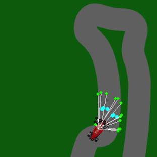

# FormulaAI



Reinforced Learning algorithm to teach a car how to go around a track

## Getting started

First, in [main.py](app/main.py) you can select which track to test by selecting a **track_id**.

| **track id**  | **track name**               |
|-------------- |----------------------------- |
| 0             | Autonomo Hermanos Rodriguez  |
| 1             | Circuit of the Americas      |
| 2             | Monaco                       |
| 3             | Monza                        |

Make sure you already installed all the project dependencies. Now, run the following command from **/FormulaAI**:

```{python}
cd app && python3 main.py
```

## Reference

- [Feed-forward neural net](https://github.com/codewmax/DriveAI/blob/master/main.py)
- [Displaying text in a pygame window](https://stackoverflow.com/questions/20842801/how-to-display-text-in-pygame)
- [Driving a car using the pygame library](https://www.youtube.com/watch?v=V_B5ZCli-rA&list=RDCMUC4JX40jDee_tINbkjycV4Sg&index=3&ab_channel=TechWithTim)
